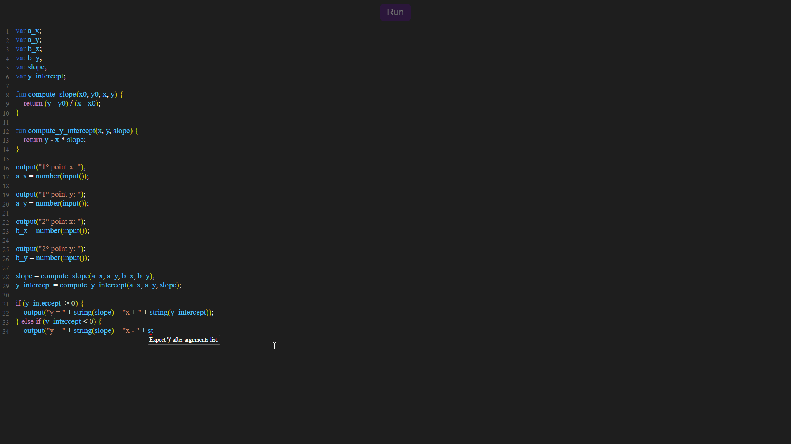

<h1 align="center">Simpl</h1>

&nbsp;&nbsp;&nbsp;&nbsp; Simpl is a basic interpred script language with arrays, structs, closure, I/O, and so on. You can play with <a href="https://saymow-simple.vercel.app/" target="_blank">here</a>.

## Playground

</img>

## Syntax grammar

</img>
