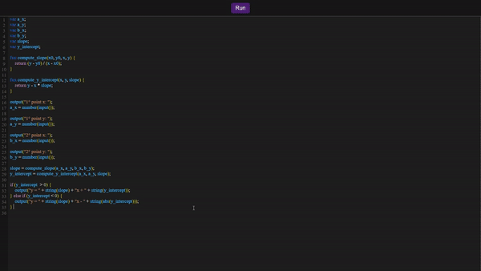
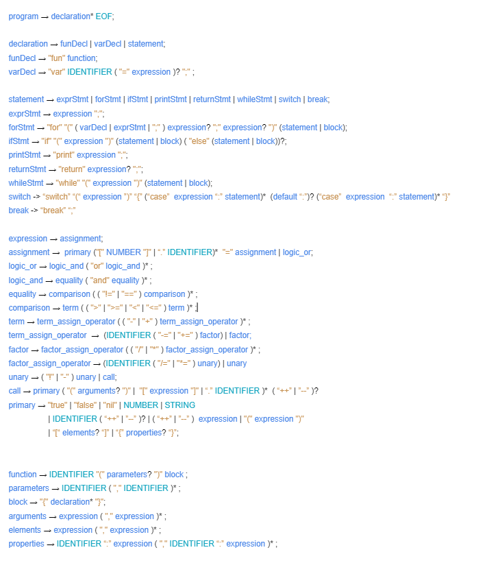

<h1 align="center">Simpl Web</h1>

 

&nbsp;&nbsp;&nbsp;&nbsp; Simpl web is a basic <a href="https://imantung.medium.com/tree-walk-interpreter-b33fe5c19a63" target="_blank">Tree-Walk script language</a> version of the <a href="https://github.com/saymow/simpl" target="_blank">Simpl programming language</a>  with arrays, structs, closure, I/O, and so on. You can play with <a href="https://simpl-web-programming-language.vercel.app/?snippet=lexer" target="_blank">its online IDE</a>.

## Playground

</img>

## Playground Snippets

- [Lexer](https://simpl-web-programming-language.vercel.app?snippet=lexer)
- [Dijkstra](https://simpl-web-programming-language.vercel.app?snippet=dijkstra)
- [Breadth First Search](https://simpl-web-programming-language.vercel.app?snippet=breadth_first_search)
- [Linear Function](https://simpl-web-programming-language.vercel.app?snippet=linear_function)
- [To-do List](https://simpl-web-programming-language.vercel.app?snippet=todo_list)
- [Insertion Sort](https://simpl-web-programming-language.vercel.app?snippet=insertion_sort)
- [Average Calculator](https://simpl-web-programming-language.vercel.app?snippet=avg)
- [Body Mass Index Calculator](https://simpl-web-programming-language.vercel.app?snippet=bmi)

## Syntax grammar

</img>
